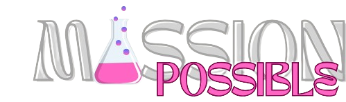
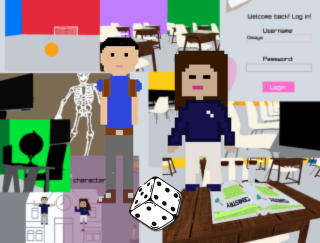

<h1 align="center">✨👨‍🎓 MISSION:POSSIBLE 👩‍🎓✨ </h1>

  
  

<h1 >📋 Description </h1>
Our goal is to provide access to an easier and more interesting way to study the material. We have created an online environment as close to the real world as possible, where anyone can register and have their own account. After each test, you will be graded based on the knowledge you have demonstrated. Join our challenge!

<h1 align="left">TEAM MEMBERS 👨🏻‍💻</h1>
<table >
  
  <tr>
    <td>Name</td>
    <td>Role</td>
    <td>Grade</td>
  </tr> 
  <tr>
    <td> Dimaya Noneva</td>
    <td>Scrum trainer</td>
    <td>🟥 9B</td>
  </tr>
  <tr>
    <td>Stoyan Hristov</td>
    <td>Back-end developer</td>
    <td>🟥 9B</td>
  </tr>
  <tr>
    <td>Kaloyan Ivanov</td>
    <td>Back-end developer</td>
    <td>🟥 9B</td>
  </tr>
  <tr>
    <td>Teodor Tanev</td>
    <td>Back-end developer</td>
    <td>🟩9B</td>
  </tr>
  <tr>
    <td>Georgi Filipov</td>
    <td>Back-end developer</td>
    <td>🟩9B</td>
  </tr>
  <tr>
    <td>Georgi Atanasov</td></td>
    <td>Back-end developer</td>
    <td>🟩9B</td>
  </tr>
  
</table> 

<h1 align="left">📃 Documents</h1> 
  <ul align="left" >
<li><a href="https://codingburgas-my.sharepoint.com/:p:/g/personal/dhnoneva22_codingburgas_bg/EfA3q-Ddc4tNoLweKRmC1iQBECIOqJZStSbBoIR4jxY5xw?e=pR4QA9">Documentation</a></li>
<li><a href="https://codingburgas-my.sharepoint.com/:w:/g/personal/dhnoneva22_codingburgas_bg/EUvaMjAEzQNNpp6s0eBfNgwBNvQN2pLQAWN4LXM173g93Q?e=7cyiLw">Presentation</a></li>
<li><a href="https://codingburgas-my.sharepoint.com/:x:/g/personal/dhnoneva22_codingburgas_bg/Ec6U6SybOitLv1mW3YcCb2wBZZD2ZJBMyp0zv5M3apGuvw">QA Table</a></li>    
<li><a href="https://codingburgas-my.sharepoint.com/:w:/g/personal/dhnoneva22_codingburgas_bg/Ed-X-a3YHcVKsFLrk_-nqp0BnKBjTRVi23V_W8ow-pwO2A">Test Plan</a></li>
</ul> 

<h1 align="left">Used technologies 🗂</h1>

    
   
  <a href="https://www.microsoft.com/en-us/microsoft-365/powerpoint">
  
 
  
 
